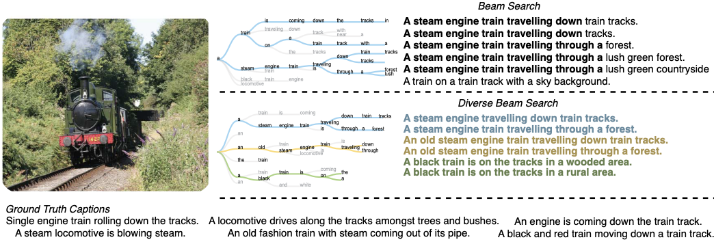

# Generating Natural Language Proofs with Verifier-Guided Search: Diverse Beam Search, Aggregation Functions, and Verifier-Weighting in NLProofS



<figure>
  
  <figcaption>[Vijayakumar et al., 2016](https://arxiv.org/abs/1610.02424)</figcaption>
</figure>

We present the code and results for an ablation study of the paper [Generating Natural Language Proofs with Verifier-Guided Search](https://arxiv.org/abs/2205.12443)  by [Kaiyu Yang](https://www.cs.princeton.edu/~kaiyuy/), [Jia Deng](https://www.cs.princeton.edu/~jiadeng/), and [Danqi Chen](https://www.cs.princeton.edu/~danqic/)  . 

## Abstract 

Hallucination of invalid nodes in stepwise proof generation poses a problem for natural language processing. Yang et al. (2022) address this issue with NLProofS, mitigating hallucination by using an auxiliary verifier model to guide the stepwise proof generation towards generating valid proof steps. In this study, we replicate the baselines of their work and expand their exploration in three primary directions: (1) varying the prover-verifier proof score weighting in scoring nodes in the proof tree, (2) incorporating diverse beam search for proof tree generation, and (3) evaluating alternative functions for aggregating the scores of nodes in the proof tree. Our highest-performing model achieved an overall proof accuracy of 36.28\% on the official Entailment Bank test dataset, therefore outperforming the (replicated) baseline score of 34.71\% achieved by the original NLProofS model.

## Quick Links

Any information regarding requirements, data preprocessing, experiments and datasets can be found [here](https://github.com/princeton-nlp/NLProofS).

### Test Results and Model Checkpoints

Slide right to see download links in the tables below.

#### Task 1

| Model         | Leaves-F1       | Leaves-AllCorrect      | Steps-F1      | Steps-AllCorrect       | Intermediates-F1       | Intermediates-AllCorrect       | Overall-AllCorrect       | Model checkpoints | Validation predictions | Test predictions  | 
| ------------- | -------- | ------- | --------------- | ------------- | ---------------- | ---------------- | ---------------- | ---------------- | ---------------- | ---------------- |
| NLProofS           | 97.6 | 90.0 | 54.8 | 41.8 | 72.0 | 39.7 | 38.2 | [prover](https://drive.google.com/file/d/16Mgor1gT_bJx3tCfT0DMyais79RM3Ka-/view?usp=sharing), [verifier](https://drive.google.com/file/d/1qR8JLwMUQWPHn_m9QImLP7RK1-PbjjuV/view?usp=sharing) | [results_val.tsv](https://drive.google.com/file/d/1pHhCt3JEbfRv7krixcyBcXa-1S-A3QYj/view?usp=sharing) | [results_test.tsv](https://drive.google.com/file/d/11DZRqzefU55AOobsvm8dpTLVHnMc-hHN/view?usp=sharing) |
| Stepwise prover    | 98.8 | 98.5 | 54.8 | 41.5 | 71.9 | 38.5 | 36.8 | The `prover` above       | [results_val.tsv](https://drive.google.com/file/d/1PTbs_pO5Fds-RtpHtnK6ddXFgyu8trMl/view?usp=sharing) | [results_test.tsv](https://drive.google.com/file/d/1v6qN9xjX9RRDquXtgX0rwONU7XJKubE5/view?usp=sharing) |
| Single-shot prover | 98.2 | 82.7 | 51.8 | 40.9 | 66.7 | 36.5 | 34.7 | [prover](https://drive.google.com/file/d/1l4ULsNqdNMco-tyOKiLxvxhaSo6TSyzy/view?usp=sharing)               | [results_val.tsv](https://drive.google.com/file/d/1xncmUFBFQTO1ksflhZhiHMC65yaRN5zC/view?usp=sharing) | [results_test.tsv](https://drive.google.com/file/d/1MVGheKhG7XpP9Ejy0WCuZHUnlmhISl_T/view?usp=sharing) |

#### Task 2

| Model         | Leaves-F1       | Leaves-AllCorrect      | Steps-F1      | Steps-AllCorrect       | Intermediates-F1       | Intermediates-AllCorrect       | Overall-AllCorrect       | Model checkpoints | Validation predictions | Test predictions  | 
| ------------- | -------- | ------- | --------------- | ------------- | ---------------- | ---------------- | ---------------- | ---------------- | ---------------- | ---------------- |
| NLProofS           | 90.3 | 60.6 | 48.6 | 35.6 | 70.3 | 39.4 | 34.4 | [prover](https://drive.google.com/file/d/1T10tJ7S1RBWYc-_uQ11ALAhHiQc2V6aN/view?usp=sharing), [verifier](https://drive.google.com/file/d/1l9xLcKbJoFzmnvgQgnvuvncdP8u2FQbV/view?usp=sharing) | [results_val.tsv](https://drive.google.com/file/d/15emy7mokuqnoFjf5t5uLM98W3Oq94U_5/view?usp=sharing) | [results_test.tsv](https://drive.google.com/file/d/1_L4_25KLgxhoEMcOAKPMYAzyvrdYwXmI/view?usp=sharing) |
| Stepwise prover    | 90.3 | 57.1 | 48.6 | 35.6 | 70.1 | 38.5 | 33.8 | The `prover` above       | [results_val.tsv](https://drive.google.com/file/d/1Mkj_uTg4COo16TR5F7lIaoUpqoYMKWQ8/view?usp=sharing) | [results_test.tsv](https://drive.google.com/file/d/1XyO_cDE8RYEEwiaBUH5efpWWjjHe0D2C/view?usp=sharing) |
| Single-shot prover | 85.9 | 44.7 | 41.3 | 29.1 | 62.5 | 31.5 | 27.7 | [prover](https://drive.google.com/file/d/1hk5ekp4FQb1-lqEDbbZnYQhxZiafL8Vm/view?usp=sharing)               | [results_val.tsv](https://drive.google.com/file/d/16zZopp0DHNMFXHVX_zmLAEhFNd9i-D3z/view?usp=sharing) | [results_test.tsv](https://drive.google.com/file/d/1ubmt1zCfg__I4f0odiKs4fcT78Sr1Rku/view?usp=sharing) |

#### Task 3

Results on Task 3 are produced by evaluating Task 2 models zero-shot on Task 3 data (by changing `--data.path_val` and `--data.path_test`).

| Model         | Leaves-F1       | Leaves-AllCorrect      | Steps-F1      | Steps-AllCorrect       | Intermediates-F1       | Intermediates-AllCorrect       | Overall-AllCorrect       | Model checkpoints | Validation predictions | Test predictions  | 
| ------------- | -------- | ------- | --------------- | ------------- | ---------------- | ---------------- | ---------------- | ---------------- | ---------------- | ---------------- |
| NLProofS           | 43.9 | 9.1 | 10.6 | 6.8 | 42.4 | 15.9 | 6.8 | Same as Task 2 | [results_val.tsv](https://drive.google.com/file/d/19Ohmhgb8HhUL6UMkcjx2nCvEC9n6hODJ/view?usp=sharing) | [results_test.tsv](https://drive.google.com/file/d/1kAfBQLe-cIlQknwWXLf4-v5KkflEUkdq/view?usp=sharing) |
| Stepwise prover    | 42.8 | 7.4 | 9.3 | 5.9 | 42.1 | 15.0 | 5.9 | Same as Task 2 | [results_val.tsv](https://drive.google.com/file/d/1yOOkixHfo3l6KuG3eJlCYEkGdxDfqLki/view?usp=sharing) | [results_test.tsv](https://drive.google.com/file/d/1TOzYy_8qSli1--ej7ku7deTntEwUq3IP/view?usp=sharing) |
| Single-shot prover | 40.5 | 4.4 | 9.1 | 3.8 | 35.3 | 7.9 | 3.8 | Same as Task 2 | [results_val.tsv](https://drive.google.com/file/d/1PICdgzf48nsE1vgJlaAiNoA4S3HjBA77/view?usp=sharing) | [results_test.tsv](https://drive.google.com/file/d/1nRPLQ-DfbDj3b9EL7pLhs4IJl2vKkJKd/view?usp=sharing) |


## RuleTaker Experiments

### Training

#### Prover

Training on RuleTaker is similar to training on EntailmentBank but with different configuration files. Run the following commands in [./prover/](./prover): 
```bash
python main.py fit --config cli_ruletaker_single_shot_t5-large.yaml  # Train a single-shot prover on D0–D3 of RuleTaker (OWA).
python main.py fit --config cli_ruletaker_stepwise_t5-large.yaml     # Train a stepwise prover on D0–D3 of RuleTaker (OWA).
```

#### Verifier

Training the verifier is also similar. Run the following commands in [./verifier/](./verifier): 
```bash
python main.py fit --config cli_ruletaker.yaml  # Train a verifier on D0–D3 of RuleTaker (OWA).
```

### Validation and Testing

`cd` into [./prover/](./prover). Assume we have a prover checkpoint `PATH_TO_PROVER_CKPT` and a verifier checkpoint `PATH_TO_VERIFIER_CKPT`.
```bash
python main.py validate --config cli_ruletaker_stepwise_t5-large.yaml --ckpt_path PATH_TO_PROVER_CKPT --model.verifier_weight 0.5 --model.verifier_ckpt PATH_TO_VERIFIER_CKPT --model.proof_search true --trainer.limit_val_batches 1.0  # Validate NLProofS on D0–D3 of RuleTaker (OWA).
python main.py test --config cli_ruletaker_stepwise_t5-large.yaml --ckpt_path PATH_TO_PROVER_CKPT --model.verifier_weight 0.5 --model.verifier_ckpt PATH_TO_VERIFIER_CKPT --model.proof_search true  # Test NLProofS on D0–D3 of RuleTaker (OWA).
```

Note the `--trainer.limit_val_batches 1.0` above. By default, we use only 200 batches for RuleTaker validation (see [./prover/cli_ruletaker_stepwise_t5-large.yaml](prover/cli_ruletaker_stepwise_t5-large.yaml) and [./prover/cli_ruletaker_single_shot_t5-large.yaml](prover/cli_ruletaker_single_shot_t5-large.yaml)), but here we want to use all batches.

Validation and testing results are saved as `./prover/lightning_logs/EXP_ID/results_val.json` and `./prover/lightning_logs/EXP_ID/results_test.json`. Run the following command for final evaluation:
```bash
python evaluate.py ruletaker --path-val PATH_TO_VAL_RESULTS --path-test PATH_TO_TEST_RESULTS
```

### Test Results and Model Checkpoints


| Model         | Answer accuracy       | Proof accuracy     | Model checkpoints | Validation predictions | Test predictions  | 
| ------------- | -------- | -------- | --------------- | ------------- | ----------------- |
| NLProofS           | 99.3 | 99.2 | [prover](https://drive.google.com/file/d/1Js-jCyt8yGvwMyowwOkq-5bn0lvY2FQz/view?usp=sharing), [verifier](https://drive.google.com/file/d/1l2-vCU6TQ4_OtTygXXLGiJ7UUzuDeyN2/view?usp=sharing) | [results_val.json](https://drive.google.com/file/d/1JhCIhPkPdyoNpNhB0uNZr2WXB6ffuSBG/view?usp=sharing) | [results_test.json](https://drive.google.com/file/d/134HjjaYztCb-nLUqtdQ7hWxO4SO1ZW6d/view?usp=sharing) |
| Stepwise prover    | 68.7 | 91.3 | The `prover` above       | [results_val.json](https://drive.google.com/file/d/1aB3ciVCX2_h9qYVyKJ6qhlJS8T_w26wf/view?usp=sharing) | [results_test.json](https://drive.google.com/file/d/1WO2c1C_4WIjHRVU4emiMzWt4s1lndviV/view?usp=sharing) |
| Single-shot prover | 56.3 | 72.6 | [prover](https://drive.google.com/file/d/1yg5c2MXnGFVr6b7g9dFCeIAhMyb0gS_m/view?usp=sharing)               | [results_val.json](https://drive.google.com/file/d/1NGtCfAp4F3eUEEGT7J0IGK7-UCP8YYPA/view?usp=sharing) | [results_test.json](https://drive.google.com/file/d/1HeXiKU0IcRTCZ-_0u0unHmZge54E7Iyu/view?usp=sharing) |


## Bugs or Questions

If you have any questions related to the code or the paper, feel free to email [Kaiyu](https://yangky11.github.io/). If you encounter any problems when using the code, or want to report a bug, you can open an issue. Please try to specify the problem with details so we can help you better and quicker!


## Citation

```bibtex
@inproceedings{yang2022nlproofs,
  title={Generating Natural Language Proofs with Verifier-Guided Search},
  author={Yang, Kaiyu and Deng, Jia and Chen, Danqi},
  booktitle={Conference on Empirical Methods in Natural Language Processing (EMNLP)},
  year={2022}
}
```

## Credits
 
* The code is formatted using [](https://github.com/psf/black).

